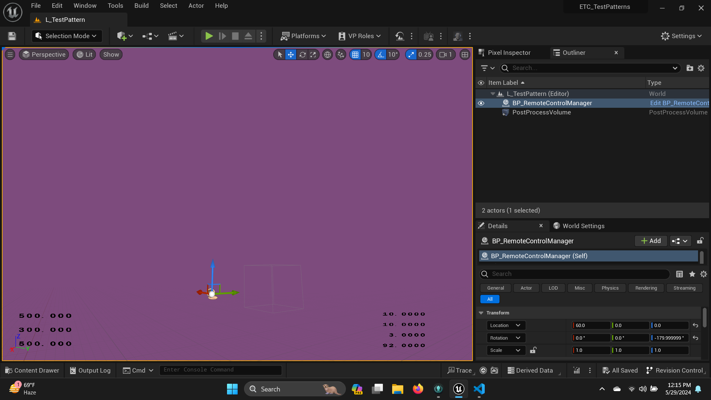

# UnrealTPG

This project was initially developed by [christiannng](https://github.com/christiannng) and [Josh Kerekes](https://github.com/joshkerekes). It implements a very simple test pattern generator developed by ICVFX developers based on [Unreal Engine 5.2](https://www.unrealengine.com/en-US). The project uses multiple blueprints and the RemoteControl extension to open up a JSON api to control the output color of the game window. It has been validated on Windows 11 with NVIDIA Quadro P2000 (On a ThinkPad laptop) to accurate output 10bit RGB HDMI testpatterns. 

A few notes...
1) The game is not configured to use HDR meaning that the back buffer of the output is determined by the desktop bit depth configured in NVIDIA desktop. _After connecting the LED processor HDMI input_, make the following changes:
    1) Under Display > Change resolution:
        1) Make sure to select "SDR 30 bits"
        2) change output color depth to "10 bits"
        3) color format to "RGB"
        4) output dynamic range to "Full".
2) The game engine is listening on port 30010 for TPG commands. Check that this is allowed in your firewall settings. Some API examples [are documented on Postman](https://www.postman.com/aviation-cosmonaut-83374217/workspace/openledeval). 
3) It's highly reccomended to use a "caffine" program for your test pattern computer to prefent it from sleeping.
    1) [Amphetamine for Windows](https://apps.microsoft.com/detail/9NBLGGH4WHSP?hl=en-us&gl=US)
    2) After starting amphetmine, put it in compact mode and then click back on the unreal editor window.

 ## How to use

1) Download this repository

2) Download UnrealEngine v 5.2.1 via the Epic Games Launcher

3) Use nvidia control panel or similar to set the desktop color space / color depth as high as possible. For example, with a 4k screen you can set to 30fps, RGB, 12bits. The nvidia control panel can be quite a pain.

4) Open the "ETC_TestPatterns" unreal project by double clicking in the file browser. 

When the Unreal Editor launches you should see a screen like this:

The majority of the purple frame is the test color. The current color value is showin in the bottom left. The launch color is R:500, G:300, B:500. Your computer's 4-part IPV4 number is shown in the bottom right for convenience. 

While there are some UI elements on the screen, the areas away from the UI and away from the ground plane in the level editor are the pure color from the TPG API. The API uses floating point numbers on a 10-bit scale, but can actually produce any values available to the unreal editor depending on the desktop bit depth settings. 

